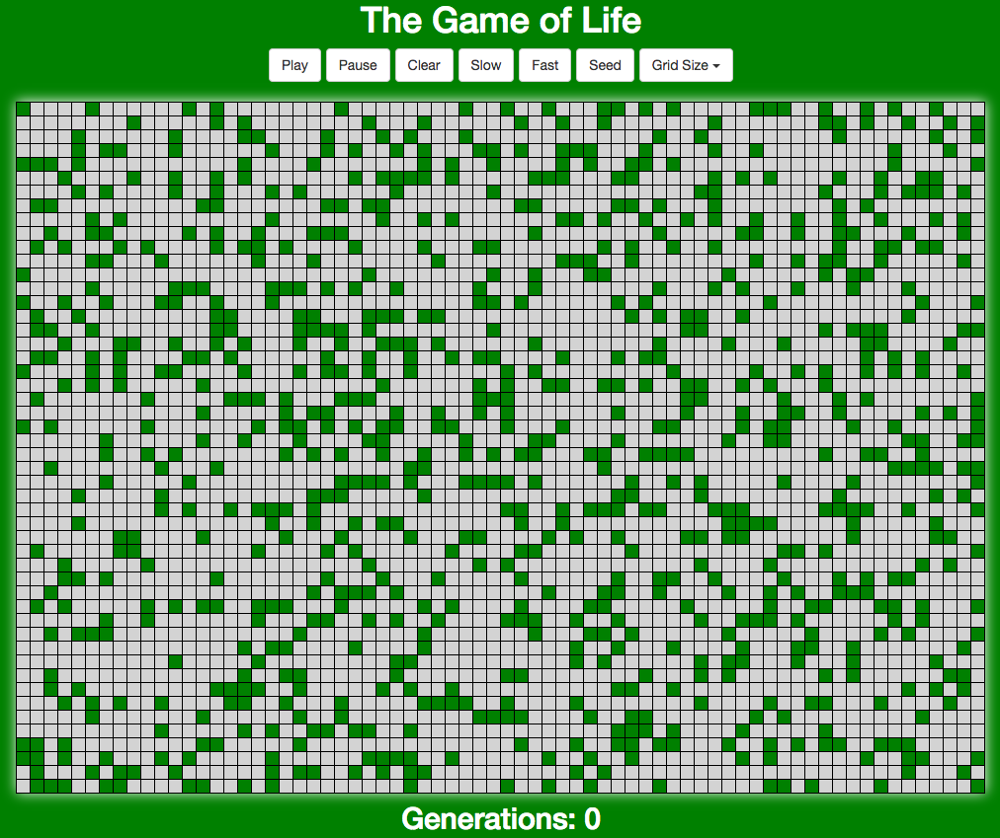
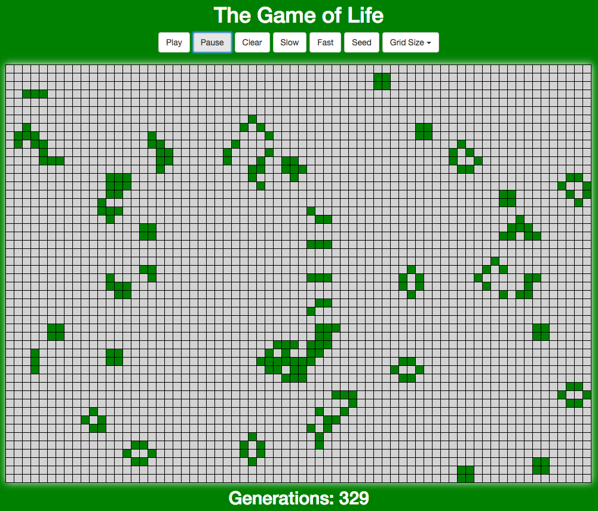
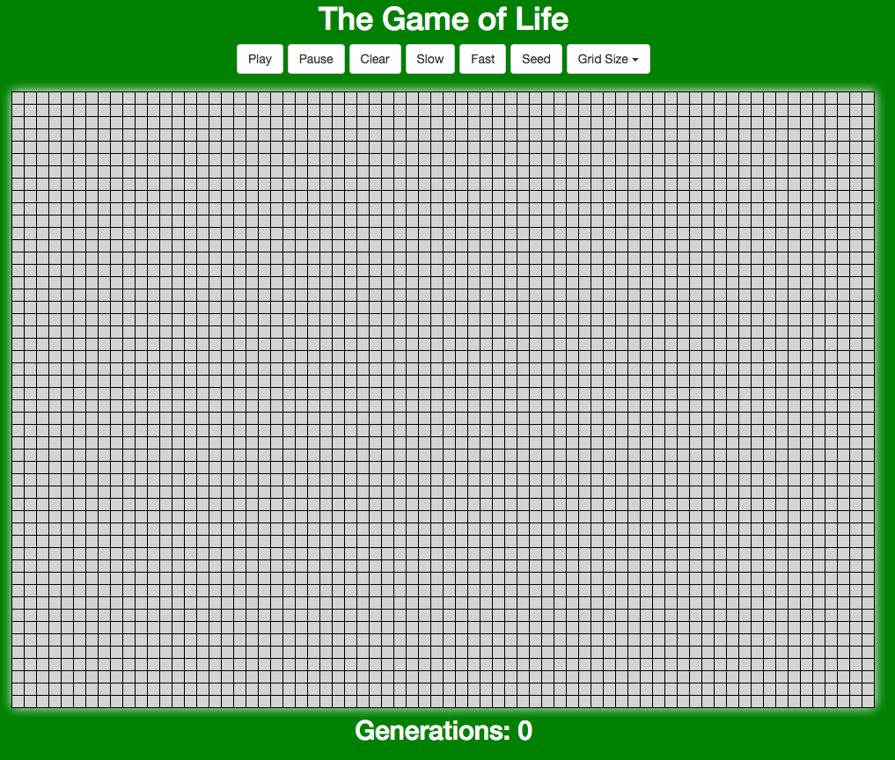

# Game of Life
The game is a zero-player game, meaning that its evolution is determined by its initial state, requiring no further input. One interacts with the Game of Life by creating an initial configuration and observing how it evolves, or, for advanced players, by creating patterns with particular properties.

[Link to application](https://coffeina.github.io/Game.Of.Life/)
___

<p align="center">
  
</p>

___

## Seed function

```javascript
seed = () => {
  let gridCopy = arrayClone(this.state.gridFull);
  for (let i = 0; i < this.rows; i++){
    for (let j = 0; j < this.cols; j++) {
      if(Math.floor(Math.random() * 4) === 1) {
        gridCopy[i][j] = true;
      }
    }
  }

```

## State generation
```javascript
play = () => {
  let g = this.state.gridFull;
  let g2 = arrayClone(this.state.gridFull);
  for (let i = 0; i < this.rows; i++) {
    for (let j = 0; j < this.cols; j++) {
      let count = 0;
      if (i > 0) if (g[i - 1][j]) count++;
      if (i > 0 && j > 0) if (g[i - 1][j - 1]) count++;
      if (i > 0 && j < this.cols - 1) if (g[i - 1][j + 1]) count++;
      if (j < this.cols - 1) if (g[i][j + 1]) count++;
      if (j > 0) if (g[i][j - 1]) count++;
      if (i < this.rows - 1) if (g[i + 1][j]) count++;
      if (i < this.rows - 1 && j > 0) if (g[i + 1][j - 1]) count++;
      if (i < this.rows - 1 && this.cols - 1) if (g[i + 1][j + 1]) count++;
      if (g[i][j] && (count < 2 || count > 3)) g2[i][j] = false;
      if (!g[i][j] && count === 3) g2[i][j] = true;
      }
    }
    this.setState({
      gridFull: g2,
      generation: this.state.generation + 1
    });
}
```
___

<p align="center">
  
</p>

___


## Components
```javascript
class Buttons extends React.Component {
  handleSelect = (evt) => {
    this.props.gridSize(evt);
  }
  render() {
    return (
      <div className="center">
        <ButtonToolbar>
          <button className="btn btn-default" onClick={this.props.playButton}>
            Play
          </button>
          <button className="btn btn-default" onClick={this.props.pauseButton}>
            Pause
          </button>
          <button className="btn btn-default" onClick={this.props.clear}>
            Clear
          </button>
          <button className="btn btn-default" onClick={this.props.slow}>
            Slow
          </button>
          <button className="btn btn-default" onClick={this.props.fast}>
            Fast
          </button>
          <button className="btn btn-default" onClick={this.props.seed}>
            Seed
          </button>
          <DropdownButton
            title="Grid Size"
            id="size-menu"
            onSelect={this.handleSelect}
          >
            <MenuItem eventKey="1">20x10</MenuItem>
            <MenuItem eventKey="2">50x30</MenuItem>
            <MenuItem eventKey="3">70x50</MenuItem>
          </DropdownButton>
        </ButtonToolbar>
      </div>
    )
  }
}
```
___

<p align="center">
  
</p>

___


## License
`Game of Life` is available under the MIT license.
